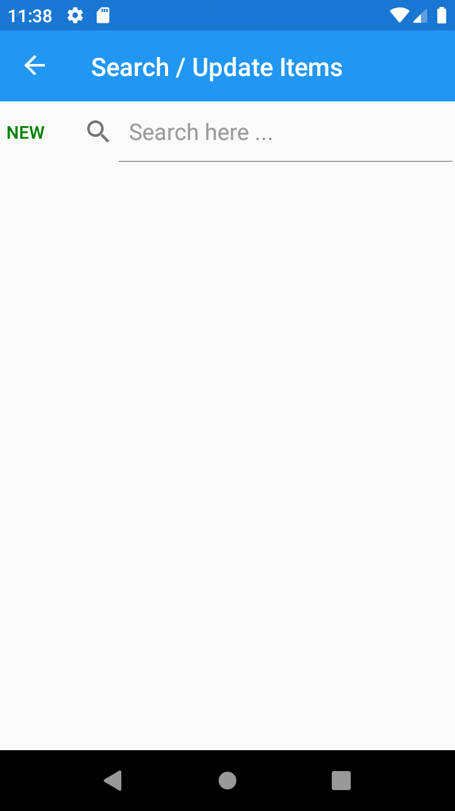

# InventoryOrderManger
To track items, Inventory and Orders

# Tasks
- Create Items with Name, Sell price, Purchase price, Description and Stock Quantity
- View created Items
- Search Items and update if needed, or can be deleted by tap and hold
- Create Order with customer name, and Items with requied Qty
- Item price will be loaded automatically and can be modified if required
- Items can be created from Order on the go if required
- Item line price and total price will be calculated automatically and loaded
- View order, search and update 

## Comming soon
- Export 
- Backup

# Screenshots

